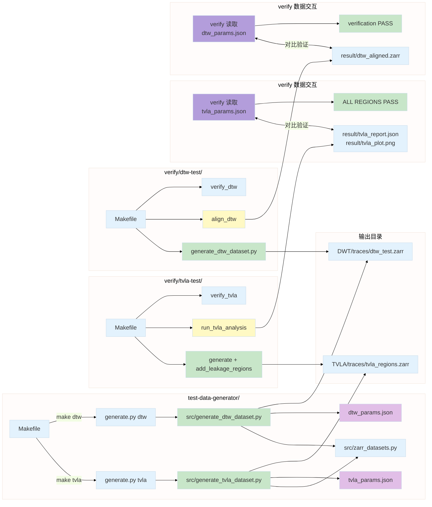

```mermaid
%%{init: {"theme": "base", "themeVariables": {
    "fontSize": "20px",
    "fontFamily": "monospace",
    "nodeText fontsize": "18px",
    "edgeLabel fontsize": "16px",
    "primaryColor": "#e3f2fd",
    "background": "#ffffff"
}}}%%
flowchart LR
    subgraph "test-data-generator/"
        TD_MF["Makefile"]
        TD_MF --> |"make tvla"| TD_G1["generate.py tvla"]
        TD_MF --> |"make dtw"| TD_G2["generate.py dtw"]

        TD_G1 --> TD_TVLAGEN["src/generate_tvla_dataset.py"]
        TD_G2 --> TD_DTWGEN["src/generate_dtw_dataset.py"]

        TD_TVLAGEN --> TD_ZARR["src/zarr_datasets.py"]
        TD_DTWGEN --> TD_ZARR

        TD_TVLAGEN --> TD_TVLAJSON["tvla_params.json"]
        TD_DTWGEN --> TD_DTWJSON["dtw_params.json"]
    end

    subgraph "verify/tvla-test/"
        VT_MF["Makefile"]
        VT_MF --> VT_GEN["generate + add_leakage_regions"]
        VT_MF --> VT_ANALYZE["run_tvla_analysis"]
        VT_MF --> VT_VERIFY["verify_tvla"]
    end

    subgraph "verify/dtw-test/"
        DT_MF["Makefile"]
        DT_MF --> DT_GEN["generate_dtw_dataset.py"]
        DT_MF --> DT_ALIGN["align_dtw"]
        DT_MF --> DT_VERIFY["verify_dtw"]
    end

    subgraph "输出目录"
        TVLA_OUT["TVLA/traces/tvla_regions.zarr"]
        DTW_OUT["DWT/traces/dtw_test.zarr"]
    end

    TD_TVLAGEN --> TVLA_OUT
    TD_DTWGEN --> DTW_OUT
    VT_GEN --> TVLA_OUT
    DT_GEN --> DTW_OUT

    VT_ANALYZE --> VT_RESULT["result/tvla_report.json<br/>result/tvla_plot.png"]

    subgraph "verify 数据交互"
        VI_TVLA["verify 读取<br/>tvla_params.json"]
        VI_TVLA <--> |"对比验证"| VT_RESULT
        VI_TVLA --> VT_PASS["ALL REGIONS PASS"]
    end

    DT_ALIGN --> DT_ALIGNED["result/dtw_aligned.zarr"]

    subgraph "verify 数据交互"
        VI_DTW["verify 读取<br/>dtw_params.json"]
        VI_DTW <--> |"对比验证"| DT_ALIGNED
        VI_DTW --> DT_PASS2["verification PASS"]
    end

    style TD_MF fill:#e3f2fd
    style VT_MF fill:#e3f2fd
    style DT_MF fill:#e3f2fd
    style TD_TVLAGEN fill:#c8e6c9
    style TD_DTWGEN fill:#c8e6c9
    style TD_TVLAJSON fill:#e1bee7
    style TD_DTWJSON fill:#e1bee7
    style VT_GEN fill:#c8e6c9
    style DT_GEN fill:#c8e6c9
    style VT_ANALYZE fill:#fff9c4
    style DT_ALIGN fill:#fff9c4
    style VI_TVLA fill:#b39ddb
    style VI_DTW fill:#b39ddb
    style VT_PASS fill:#c8e6c9
    style DT_PASS2 fill:#c8e6c9
```